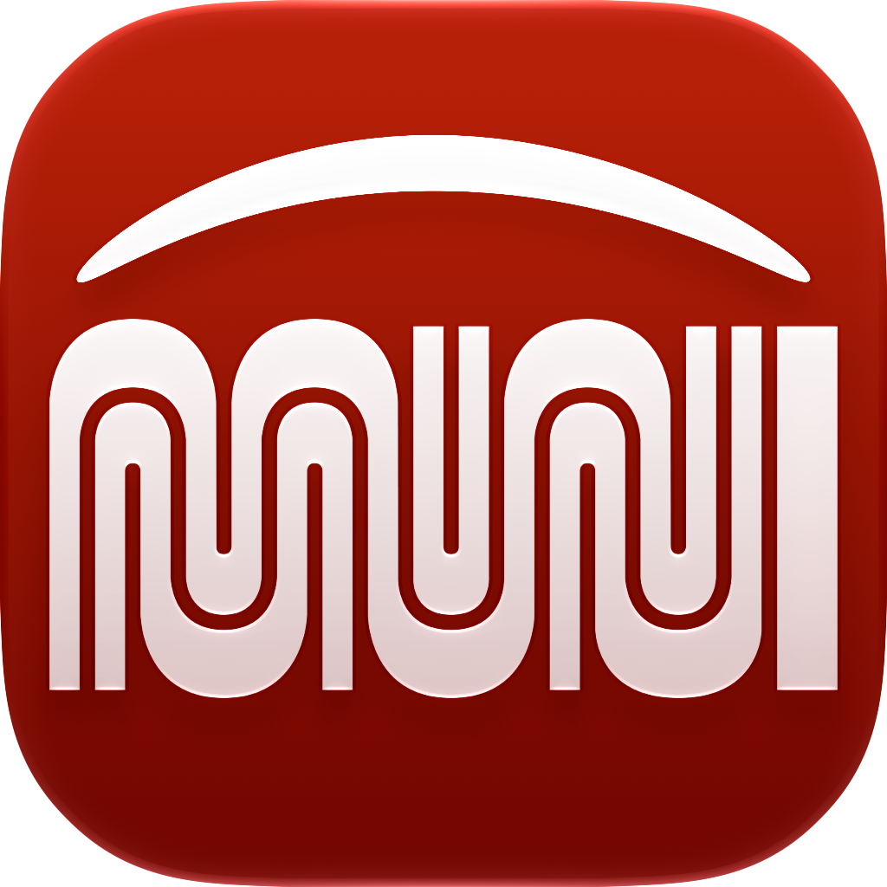
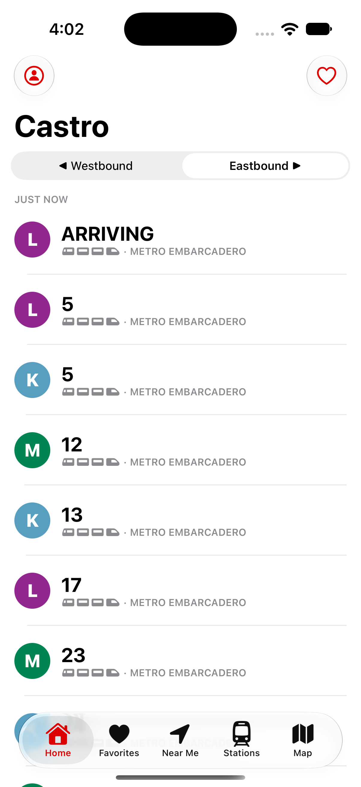
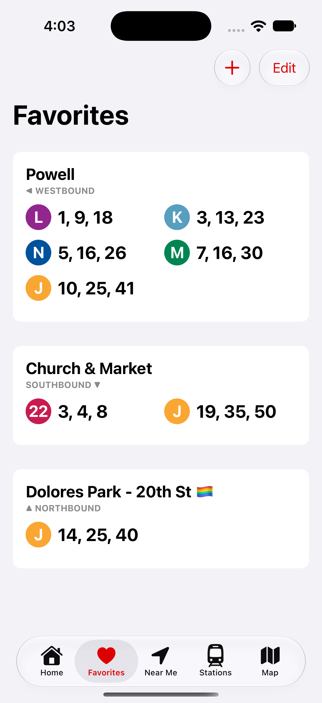
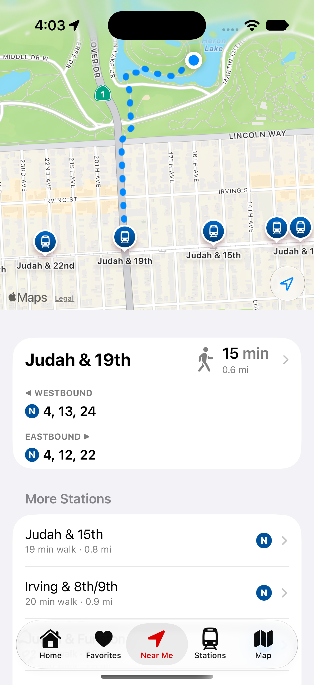
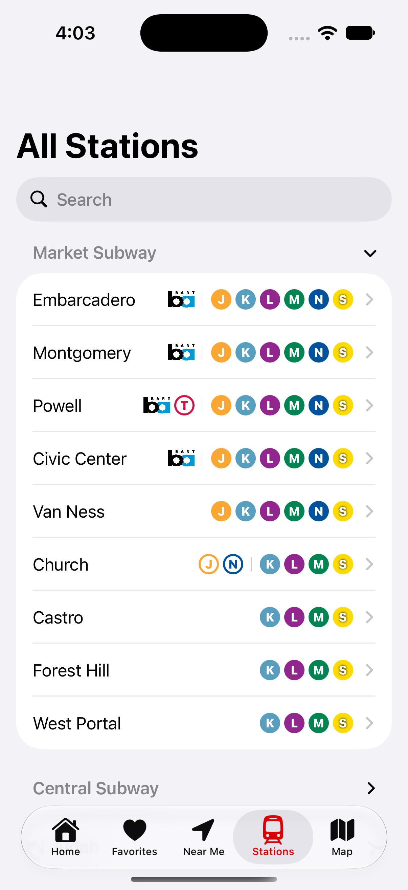
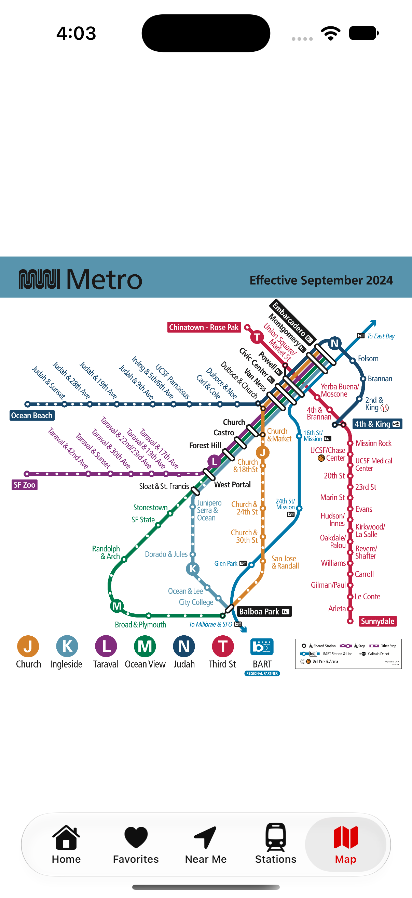

# Muni+

**Muni+**: a station-based transit app for San Francisco's Muni Metro system.

Unlike other transit apps, Muni+ is station-based instead of trip-based, giving you fast access to upcoming trains without worrying about entering a destination.

## Features

- Shows predictions for every light rail stop in SF
- Fast API thanks to Cloudflare
- All metro lines: L-Taraval, M-Ocean View, J-Church, N-Judah, T-Third St
- Search stations by name
- Set home and favorites
- See nearby stations on a map, with walking estimates
- Custom bus stops via 5-digit stop codes
- Transfer stations displayed
- Offline Muni Metro map

  
  
  
  
  

## Get the app

Available on the App Store: [Muni+ on the App Store](https://apps.apple.com/us/app/muni-underground/id1484151359)

- **Category:** Navigation
- **Price:** Free
- **Compatibility:**
  - iPhone: iOS 17.6 or later
  - iPad: iPadOS 17.6 or later
- **Languages:** English
- **Age Rating:** 4+
- **Privacy:** The developer does not collect any data from this app.

## About this repo
This is the public home for Muni+.
**Open an issue here to report bugs, request features, or flag data problems** (e.g. incorrect stop codes, missing stations, outdated line info).

## AI disclosure

This support repo was created with AI assistance.
Muni+ app itself is mostly human-coded (100% of the UI was built by hand). AI assistance was used for data parsing and map features.

## License

© Naren Hazareesingh
